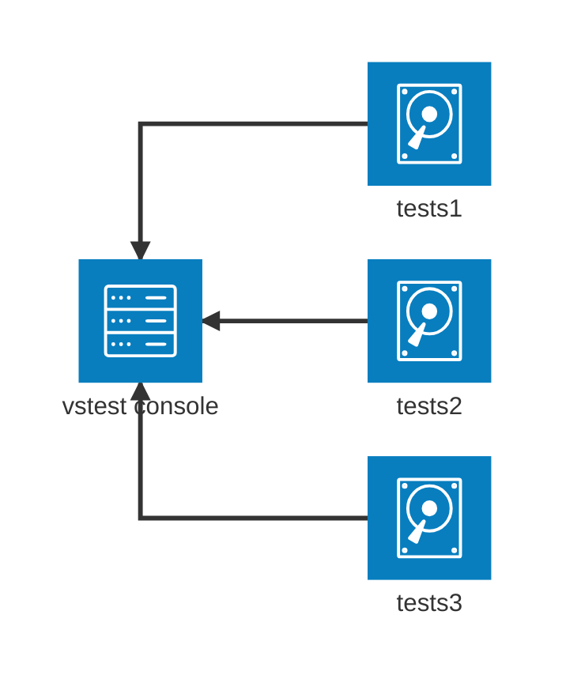
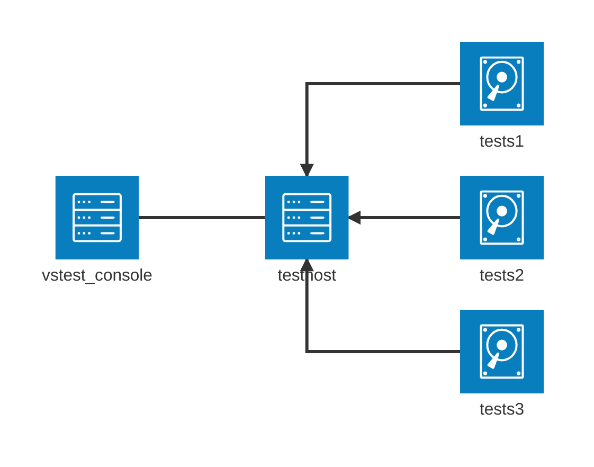

```mermaid
architecture-beta
    service console(server)[vstest console]
    service tests1(disk)[tests1]
    service tests2(disk)[tests2]
    service tests3(disk)[tests3]

    tests1:L --> T:console
    tests2:L --> R:console
    tests3:L --> B:console
```

OR in testhost:

```mermaid
architecture-beta
    service console(server)[vstest_console]
    service testhost(server)[testhost]
    service tests1(disk)[tests1]
    service tests2(disk)[tests2]
    service tests3(disk)[tests3]

    console:R -- L:testhost
    tests1:L --> T:testhost
    tests2:L --> R:testhost
    tests3:L --> B:testhost
```